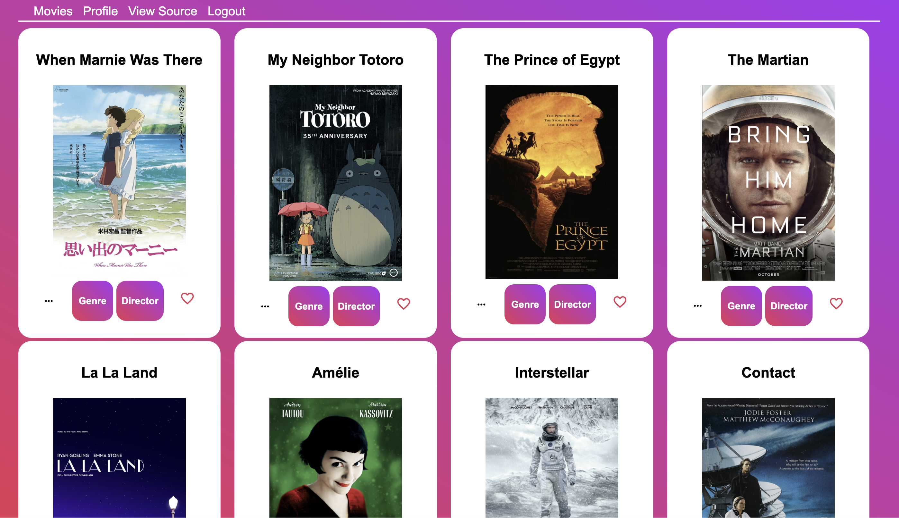

# MyFlix (Angular client)

This project is live at https://nier-bian.github.io/myflix-angular-client/.

This (TypeScript) project serves as the front-end of [myFlix-backend](https://github.com/NIER-BIAN/myFlix-backend) and was built with Angular, Angular Material. It includes functionalities for user authentication, signing up, logging in, maintaining a list of favourited movies on one's profile, viewing movie details, and viewing details about a particular movie's director or genre. The API consumed is a [custom-built RESTful API](https://nier-myflix-backend-63a3c9fa7364.herokuapp.com/) which I also authored.

## Dev

- For dev server, run `ng serve`.

- To generate a new component, run `ng generate component component-name`.

- To deploy a new build, run `ng deploy --base-href=/myFlix-Angular-client/`.

---

中甴曱甲串申由田㗊𣊫㽬